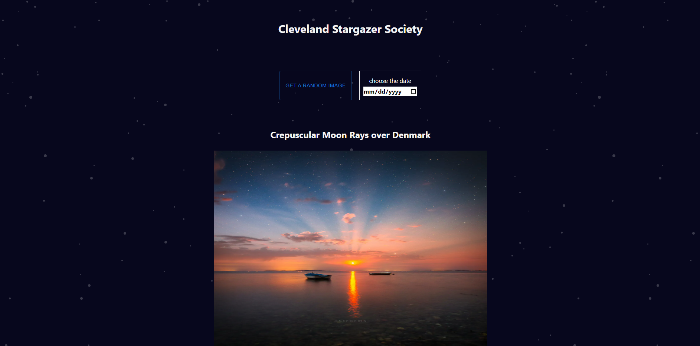

# My Awesome Project

A single page web application that displays a new picture each and every day with a quote from a professional in the field. The Cleveland Stargazer Society is meant to be enjoyed by everyone but especially those who reside in the cleveland area and are curious about our planet. This application takes use of the REST API built by NASA

**Link to project:** http://cleveland-stargazer-society.vercel.app

## How It's Made:

**Tech used:** Next JS, SASS, TypeScript, Mui, React, tailwind

I used Tailwind, SASS, and MUI for the design and rendered the application using React on top of the Next JS framework. I used Axios to fetch REST API data from NASA.

## Lessons Learned:

I learned that Next JS requires using a special <Image/> component that has a lot of handy built in features for a faster and smoother web development experience such as automatic lazy loading. I also had a hiccup because at first I thought all the API data came with a PNG image, but sometimes videos were sent and I had to first read the media_type on the api endpoints to determine what kind of media was being sent. This lead to me figuring out how to effectively and conditionally render videos using the React Player package.
